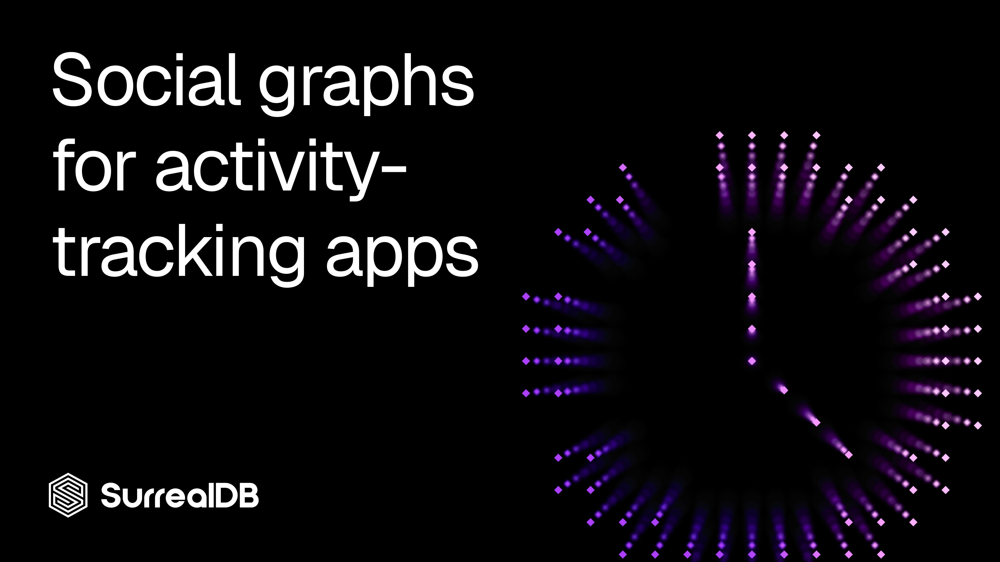

# Social graphs for activity-tracking apps



*Followers, kudos, segments, and clubs — modelled as one graph, with friend-of-friend suggestions and network-only leaderboards in a single query.*

______________________________________________________________________

## Why it matters

Every activity-tracking and social-fitness app lives or dies by its social graph. The home feed is "activities from the people I follow." Growth comes from "athletes you might know." Engagement comes from kudos and comments. And the competitive hook — the thing that keeps endurance-sports communities coming back — is the segment leaderboard, ideally filtered to just the people I follow.

Every one of those is a *graph* question. In a relational stack they become a pile of join tables (`follows`, `kudos`, `comments`, `segment_efforts`, `club_members`), and the interesting queries — friend-of-friend, "how am I connected to this athlete," leaderboards scoped to my network — turn into recursive CTEs and fan-out joins that get slower as the graph grows.

SurrealDB lets you model the whole thing directly: athletes, activities, segments, and clubs are nodes; following, recording, kudos, comments, efforts, and memberships are edges that carry their own data. Friend-of-friend becomes a two-hop traversal. A network-scoped leaderboard becomes one filter over an edge. This post walks through a compact but realistic model you can copy and adapt.

Every statement below was validated with `surreal validate` and run end-to-end against SurrealDB 3.1.5.

______________________________________________________________________

## The shape of the model

Four kinds of node and six kinds of edge cover the core of a social-fitness product:

- **Nodes** — `athlete`, `activity`, `segment` (a timed stretch of road or trail), and `club`.
- **Edges** — `follows` (athlete → athlete), `recorded` (athlete → activity), `gave_kudos` and `commented` (athlete → activity), `effort` (athlete → segment, a timed attempt), and `member_of` (athlete → club).

Three modelling choices do a lot of work here. First, **the relationships carry their own data** — a `commented` edge holds the comment text, an `effort` edge holds the elapsed time, a `member_of` edge holds the role. The relationship *is* the data, not an implicit foreign key. Second, **enums are enforced at write time** with `ASSERT $value IN [...]`, so sports and visibility levels never drift. Third, **uniqueness lives on the edges** — a `UNIQUE` index on `follows` and `gave_kudos` means you can't follow someone twice or give the same activity two kudos, without any application-level guard.

______________________________________________________________________

## The schema

```surql
-- Nodes ---------------------------------------------------------------
DEFINE TABLE athlete SCHEMAFULL;
DEFINE FIELD username      ON athlete TYPE string;
DEFINE FIELD display_name  ON athlete TYPE string;
DEFINE FIELD bio           ON athlete TYPE option<string>;
DEFINE FIELD primary_sport ON athlete TYPE option<string>
    ASSERT $value = NONE OR $value IN ["run", "ride", "swim", "hike", "walk"];
DEFINE FIELD location      ON athlete TYPE option<point>;        -- for "athletes near me"
DEFINE FIELD joined_at     ON athlete TYPE datetime DEFAULT time::now();
DEFINE INDEX athlete_username ON athlete FIELDS username UNIQUE;

DEFINE TABLE activity SCHEMAFULL;
DEFINE FIELD title       ON activity TYPE string;
DEFINE FIELD sport       ON activity TYPE string
    ASSERT $value IN ["run", "ride", "swim", "hike", "walk"];
DEFINE FIELD distance_m  ON activity TYPE decimal ASSERT $value >= 0dec;   -- metres, exact
DEFINE FIELD moving_time ON activity TYPE duration;
DEFINE FIELD elevation_m ON activity TYPE option<decimal>;
DEFINE FIELD started_at  ON activity TYPE datetime;
DEFINE FIELD visibility  ON activity TYPE string
    ASSERT $value IN ["public", "followers", "private"] DEFAULT "public";

DEFINE TABLE segment SCHEMAFULL;
DEFINE FIELD name        ON segment TYPE string;
DEFINE FIELD sport       ON segment TYPE string
    ASSERT $value IN ["run", "ride", "swim", "hike", "walk"];
DEFINE FIELD distance_m  ON segment TYPE decimal ASSERT $value >= 0dec;
DEFINE FIELD start_point ON segment TYPE option<point>;

DEFINE TABLE club SCHEMAFULL;
DEFINE FIELD name       ON club TYPE string;
DEFINE FIELD sport      ON club TYPE option<string>;
DEFINE FIELD location   ON club TYPE option<point>;
DEFINE FIELD created_at ON club TYPE datetime DEFAULT time::now();

-- Edges (graph relations) --------------------------------------------
-- The social backbone: one athlete follows another (directed).
DEFINE TABLE follows SCHEMAFULL TYPE RELATION IN athlete OUT athlete;
DEFINE FIELD since ON follows TYPE datetime DEFAULT time::now();
DEFINE INDEX follows_unique ON follows FIELDS in, out UNIQUE;

-- An athlete records an activity.
DEFINE TABLE recorded SCHEMAFULL TYPE RELATION IN athlete OUT activity;

-- Engagement: kudos (a like) and comments, both pointing at an activity.
DEFINE TABLE gave_kudos SCHEMAFULL TYPE RELATION IN athlete OUT activity;
DEFINE FIELD at ON gave_kudos TYPE datetime DEFAULT time::now();
DEFINE INDEX kudos_unique ON gave_kudos FIELDS in, out UNIQUE;  -- one kudos per athlete per activity

DEFINE TABLE commented SCHEMAFULL TYPE RELATION IN athlete OUT activity;
DEFINE FIELD text ON commented TYPE string;
DEFINE FIELD at   ON commented TYPE datetime DEFAULT time::now();

-- A segment effort: an athlete's timed attempt on a segment.
DEFINE TABLE effort SCHEMAFULL TYPE RELATION IN athlete OUT segment;
DEFINE FIELD elapsed  ON effort TYPE duration;
DEFINE FIELD activity ON effort TYPE option<record<activity>>;  -- which activity it came from
DEFINE FIELD at       ON effort TYPE datetime DEFAULT time::now();

-- Club membership, with a role on the edge.
DEFINE TABLE member_of SCHEMAFULL TYPE RELATION IN athlete OUT club;
DEFINE FIELD role  ON member_of TYPE string
    ASSERT $value IN ["member", "admin"] DEFAULT "member";
DEFINE FIELD since ON member_of TYPE datetime DEFAULT time::now();

```

A few details worth calling out:

- `option<…>` + `ASSERT` — nullable fields guard with$value = NONE OR <check>, so theprimary_sportenum check is skipped when the field is unset.
- `decimal` for distances, `duration` for times — distances stay exact and elapsed times are first-class values you can compare and sort directly (`9m12s`, `1h28m`).
- Geo `point`on athletes, segments, and clubs opens the door to "near me" discovery later.

______________________________________________________________________

## Some data to traverse

The seed below builds a small network of five athletes. The follow edges are arranged so that **Ana follows Ben and Cleo**, while **Ben and Cleo both follow Dan** — making Dan a friend-of-friend Ana doesn't follow yet.

```surql
-- Athletes
CREATE athlete:ana  SET username = "ana",  display_name = "Ana Ruiz",   primary_sport = "run",  location = (2.3522, 48.8566);
CREATE athlete:ben  SET username = "ben",  display_name = "Ben Okoro",  primary_sport = "ride", location = (-0.1276, 51.5072);
CREATE athlete:cleo SET username = "cleo", display_name = "Cleo Tan",   primary_sport = "run";
CREATE athlete:dan  SET username = "dan",  display_name = "Dan Weiss",  primary_sport = "ride";
CREATE athlete:eve  SET username = "eve",  display_name = "Eve Nilsen", primary_sport = "swim";

-- Follows (directed)
RELATE athlete:ana->follows->athlete:ben;
RELATE athlete:ana->follows->athlete:cleo;
RELATE athlete:ben->follows->athlete:dan;
RELATE athlete:cleo->follows->athlete:dan;
RELATE athlete:cleo->follows->athlete:eve;
RELATE athlete:dan->follows->athlete:ben;     -- Ben & Dan follow each other (a mutual)

-- Activities, and who recorded them
CREATE activity:run1  SET title = "Morning loop",  sport = "run",  distance_m = 10200dec, moving_time = 52m,   elevation_m = 80dec,  started_at = d"2026-06-15T06:30:00Z", visibility = "public";
CREATE activity:run2  SET title = "Tempo session", sport = "run",  distance_m = 8000dec,  moving_time = 38m,   elevation_m = 40dec,  started_at = d"2026-06-16T17:00:00Z", visibility = "followers";
CREATE activity:ride1 SET title = "Hill repeats",  sport = "ride", distance_m = 42000dec, moving_time = 1h28m, elevation_m = 650dec, started_at = d"2026-06-16T07:15:00Z", visibility = "public";
CREATE activity:ride2 SET title = "Recovery spin", sport = "ride", distance_m = 25000dec, moving_time = 55m,   elevation_m = 120dec, started_at = d"2026-06-17T18:00:00Z", visibility = "public";
CREATE activity:swim1 SET title = "Lake crossing", sport = "swim", distance_m = 1900dec,  moving_time = 41m,                          started_at = d"2026-06-14T08:00:00Z", visibility = "private";

RELATE athlete:cleo->recorded->activity:run1;
RELATE athlete:cleo->recorded->activity:run2;
RELATE athlete:ben->recorded->activity:ride1;
RELATE athlete:dan->recorded->activity:ride2;
RELATE athlete:eve->recorded->activity:swim1;

-- Kudos and comments
RELATE athlete:ana->gave_kudos->activity:ride1;
RELATE athlete:dan->gave_kudos->activity:ride1;
RELATE athlete:cleo->gave_kudos->activity:ride1;
RELATE athlete:ana->gave_kudos->activity:run1;
RELATE athlete:ben->gave_kudos->activity:run1;
RELATE athlete:ana->commented->activity:ride1 SET text = "Brutal climb!";
RELATE athlete:dan->commented->activity:run1  SET text = "Nice pace.";

-- Segments and timed efforts
CREATE segment:climb SET name = "Riverside Climb", sport = "ride", distance_m = 3200dec, start_point = (-0.12, 51.50);
CREATE segment:mile  SET name = "Park Mile",       sport = "run",  distance_m = 1609dec;

RELATE athlete:ben->effort->segment:climb SET elapsed = 9m12s,  activity = activity:ride1;
RELATE athlete:dan->effort->segment:climb SET elapsed = 8m47s,  activity = activity:ride2;
RELATE athlete:ana->effort->segment:climb SET elapsed = 10m30s;
RELATE athlete:cleo->effort->segment:mile SET elapsed = 5m48s,  activity = activity:run1;
RELATE athlete:ana->effort->segment:mile  SET elapsed = 6m02s;

-- A club, with roles on the membership edge
CREATE club:trailblazers SET name = "City Trailblazers", sport = "run", location = (2.35, 48.85);
RELATE athlete:ana->member_of->club:trailblazers SET role = "admin";
RELATE athlete:cleo->member_of->club:trailblazers;
RELATE athlete:eve->member_of->club:trailblazers;

```

______________________________________________________________________

## The home feed in one query

The feed is "public-ish activities recorded by the people I follow, newest first." That's a single path — `->follows->athlete->recorded->activity` — with a visibility filter and an order:

```surql
SELECT title, sport, started_at,
       (<-recorded<-athlete.display_name)[0] AS by
FROM   athlete:ana->follows->athlete->recorded->activity
WHERE  visibility != "private"
ORDER  BY started_at DESC;
-- => "Tempo session" (Cleo), "Hill repeats" (Ben), "Morning loop" (Cleo)

```

The path walks from Ana to the athletes she follows, then on to the activities they recorded. Hopping back the other way with `<-recorded<-athlete` recovers each activity's author for display. Eve's swim never appears — Ana doesn't follow her — and nothing marked `private` leaks in.

______________________________________________________________________

## Who to follow — friend-of-friend in a traversal

The growth engine. "People you might know" is just *the athletes followed by the athletes I follow, minus the ones I already follow (and myself)*:

```surql
LET $me        = athlete:ana;
LET $following = $me->follows->athlete;

SELECT display_name, username
FROM   array::distinct($me->follows->athlete->follows->athlete)
WHERE  id != $me AND id NOT IN $following;
-- => Dan Weiss, Eve Nilsen

```

Better still, **rank suggestions by how many of your connections already follow them** — the more mutual links, the stronger the suggestion:

```surql
LET $me        = athlete:ana;
LET $following = $me->follows->athlete;

SELECT id.display_name AS athlete, count() AS mutuals
FROM   $me->follows->athlete->follows->athlete
WHERE  id != $me AND id NOT IN $following
GROUP  BY athlete
ORDER  BY mutuals DESC;
-- => Dan Weiss (2 mutuals), Eve Nilsen (1 mutual)

```

Dan rises to the top because both Ben and Cleo follow him.

For deeper discovery, SurrealDB's recursive paths walk the follow graph to any depth. `+collect` returns the unique set of everyone reachable, and `+shortest` answers "how am I connected to this athlete?":

```surql
-- Everyone reachable from Ana through follows, at any depth
athlete:ana.{..+collect}->follows->athlete;
-- => [athlete:cleo, athlete:ben, athlete:eve, athlete:dan]

-- The shortest follow-chain from Ana to Dan
athlete:ana.{..+shortest=athlete:dan}->follows->athlete;
-- => [athlete:cleo, athlete:dan]   (Ana -> Cleo -> Dan)

```

And mutual follows — the "you both follow each other" badge — is a single filtered hop:

```surql
SELECT VALUE display_name
FROM   athlete:ben->follows->athlete
WHERE  id->follows->athlete CONTAINS athlete:ben;
-- => Dan Weiss

```

______________________________________________________________________

## Kudos and comments

Engagement counts come straight off the inbound edges of each activity — no join, no subquery:

```surql
SELECT title,
       count(<-gave_kudos) AS kudos,
       count(<-commented)  AS comments
FROM   activity
ORDER  BY kudos DESC;
-- => Hill repeats: 3 kudos / 1 comment, Morning loop: 2 / 1, ...

```

Who gave kudos, and what people said, are just edge traversals too:

```surql
-- Athletes who gave kudos to a specific activity
SELECT VALUE display_name FROM activity:ride1<-gave_kudos<-athlete;
-- => Dan Weiss, Ana Ruiz, Cleo Tan

-- Comments on an activity, with author and timestamp
SELECT in.display_name AS by, text, at
FROM   commented WHERE out = activity:ride1;
-- => Ana Ruiz: "Brutal climb!"

```

Combine the two ideas to surface the most-loved activity *in your own feed* — engagement scoped to the graph, not the whole platform:

```surql
SELECT title,
       (<-recorded<-athlete.display_name)[0] AS by,
       count(<-gave_kudos) AS kudos
FROM   athlete:ana->follows->athlete->recorded->activity
WHERE  visibility != "private"
ORDER  BY kudos DESC
LIMIT  3;
-- => Hill repeats (Ben, 3 kudos), Morning loop (Cleo, 2), Tempo session (Cleo, 0)

```

______________________________________________________________________

## Segments and leaderboards

A segment leaderboard is every effort on that segment, ordered by elapsed time. Because `elapsed` is a real `duration`, it can be used to sort the results:

```surql
SELECT in.display_name AS athlete, elapsed
FROM   effort
WHERE  out = segment:climb
ORDER  BY elapsed ASC;
-- => Dan Weiss 8m47s, Ben Okoro 9m12s, Ana Ruiz 10m30s

```

Now the feature that's genuinely painful in other databases without graph functionality: **the same leaderboard, filtered to just the people I follow.** Pull the follow set once, then filter the efforts by it:

```surql
LET $me  = athlete:ana;
LET $net = (SELECT VALUE ->follows->athlete FROM ONLY $me) ?? [];

SELECT in.display_name AS athlete, elapsed
FROM   effort
WHERE  out = segment:climb
  AND  (in IN $net OR in = $me)
ORDER  BY elapsed ASC;
-- => Ben Okoro 9m12s, Ana Ruiz 10m30s

```

Dan drops off the board — he holds the fastest time overall, but Ana doesn't follow him, so he's not part of *her* leaderboard. That single `WHERE … IN $net` clause is the whole feature.

______________________________________________________________________

## Clubs

Membership is an edge, so club rosters and club sizes fall out immediately:

```surql
-- Members of a club
SELECT VALUE display_name FROM club:trailblazers<-member_of<-athlete;
-- => Cleo Tan, Ana Ruiz, Eve Nilsen

-- Clubs ranked by membership
SELECT name, count(<-member_of) AS members FROM club ORDER BY members DESC;
-- => City Trailblazers (3)

```

Clubs are also a recommendation source: suggest the club-mates you don't already follow.

```surql
LET $me        = athlete:ana;
LET $following = $me->follows->athlete;

SELECT VALUE display_name
FROM   array::distinct($me->member_of->club<-member_of<-athlete)
WHERE  id != $me AND id NOT IN $following;
-- => Eve Nilsen

```

Ana shares the City Trailblazers club with Cleo and Eve; she already follows Cleo, so Eve is the suggestion.

______________________________________________________________________

## Why a graph, not a join table

None of these queries needed a reporting pipeline, a recursive CTE, or a separate graph database bolted onto your primary store. The feed is one path. Friend-of-friend is a two-hop traversal you can rank by mutual count. The network-scoped leaderboard — the query that's painful everywhere else — is one `IN $net` filter. And because the edges carry their own attributes (kudos timestamps, comment text, effort times, club roles), the relationships *are* data rather than implicit foreign keys.

It's all one database, so the social graph, the activity records, and the engagement metrics share a single source of truth. Adapt the sports, visibility rules, and segment model to your own product, and you have a foundation for feeds, discovery, and leaderboards that gets *easier* as the graph grows, not harder.

______________________________________________________________________

## Get started

Spin up an instance and try it yourself — paste the schema and seed into Surrealist or the CLI, then run the friend-of-friend and network-leaderboard queries against your own athletes.

- [Create a free cloud instance](https://surrealdb.com/cloud)
- [Start building](https://surrealdb.com/docs)
- [Join our Discord server](https://discord.gg/surrealdb)
