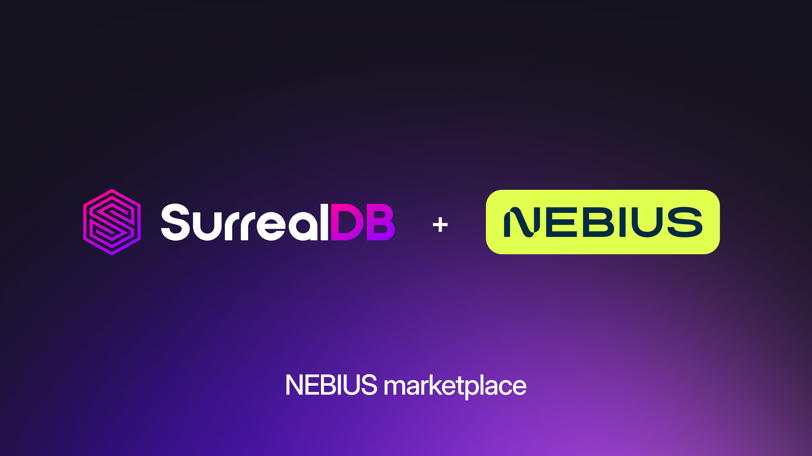

# SurrealDB is now available on the Nebius AI Cloud Marketplace

We're excited to announce that SurrealDB is now officially available on the Nebius AI Cloud Marketplace.

This launch reflects our commitment to meeting developers and AI teams where they build, and deepens our partnership with Nebius to make SurrealDB easier to adopt, deploy, and scale on one of the fastest-growing AI cloud platforms in the world.

**Why Nebius?**

Nebius is a full-stack AI cloud built for the demands of modern AI workloads. Powered by the latest GPU and high-performance networking infrastructure, with managed platform, serverless AI, and storage built for the entire AI lifecycle, Nebius gives teams the infrastructure to train, tune, and serve models at scale.

As an NVIDIA Reference Platform Cloud Partner with infrastructure across Europe and the US, Nebius pairs bare-metal performance with the operational simplicity and cost efficiency that AI teams need to move from experiment to production. It's a natural home for SurrealDB - giving you a unified data layer right alongside the compute powering your AI and agentic applications.

**Why SurrealDB?**

SurrealDB combines document, graph, and relational capabilities in one unified database - designed for agent memory, context layers, modern applications, real-time systems, and AI-powered workloads.

With flexible schema, SurrealQL, and built-in real-time features, SurrealDB enables you to build semantic and context layers powered by knowledge graphs for agent memory and multi-agentic workflows. SurrealDB simplifies your technology stack, reduces Total Cost of Ownership and operational complexity, and allows you to ship products and features in days rather than weeks.

**Get started**

SurrealDB is available now on the [Nebius AI Cloud Marketplace](https://console.nebius.com/project-e00j0yxxpr003gvmj7t4vd/applications/surrealdb). We can't wait to see what you build, join our [Discord community](https://discord.com/invite/surrealdb) and let us know how you get on!
