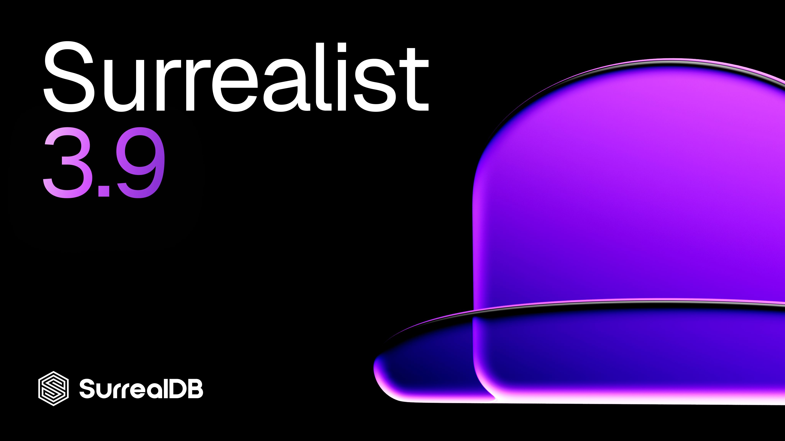
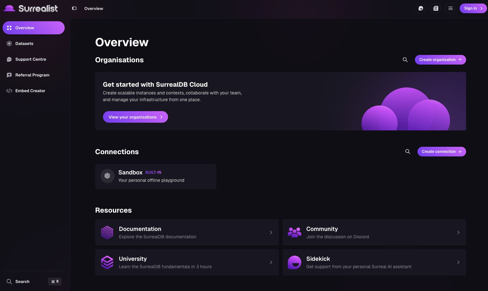
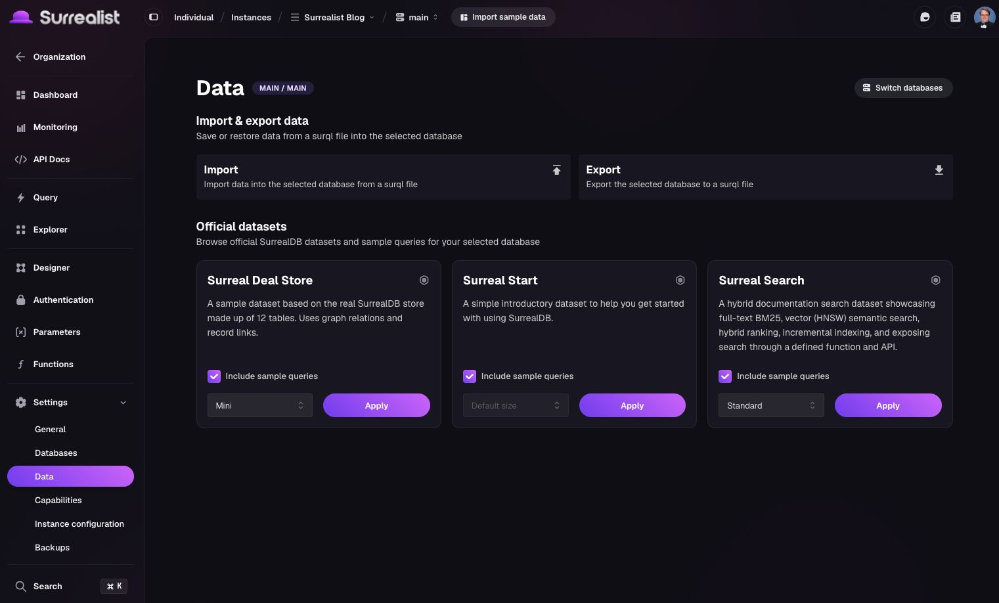
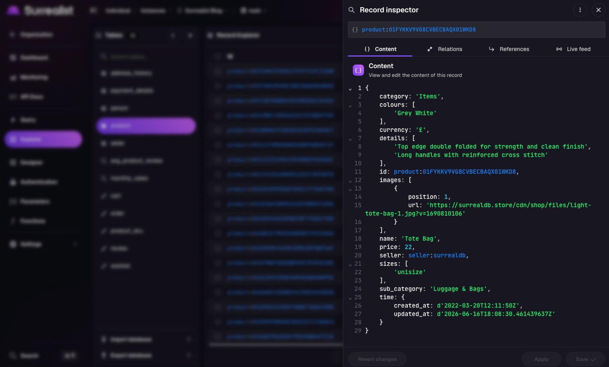

# What's new in Surrealist 3.9

We're excited to announce the release of Surrealist 3.9! This version introduces a complete design overhaul, a new datasets browser and data manager, an improved record inspector, and much more. Let's dive into what's new 🎉

## Highlights

### Complete design overhaul

Surrealist 3.9 introduces the most significant visual refresh since Surrealist 2.0. From the new sidebar and topbar to the fully revamped light theme, the entire interface has been redesigned to feel fresher, cleaner, more consistent, and easier to navigate.

Namespace and database selection has been unified into a single selection menu, making it faster to switch context without the need to navigate separate menus. Additionally, the new search input makes it easy to find what you need, even in large deployments.

Connection and instance settings have also been completely redesigned, and the overview page now includes search for both connections and organisations. These changes make it easier to find what you are looking for no matter how many instances you manage.

### New datasets browser and data manager

Working with imports and exports of your database and trying out new features with official SurrealDB demo datasets has never been easier! Surrealist 3.9 introduces a data manager and dedicated datasets browser to make managing bulk data in your database faster and more intuitive.

Additionally, it is now easier than ever to discover, browse, and apply official SurrealDB datasets to your database or Sandbox instance so that you can learn about and try new SurrealDB features in an interactive manner without needing to scroll through docs.

### Improved record inspector

The record inspector has been significantly enhanced to give you a deeper view of your data. The new References and Live tabs make it easier to explore record relationships and monitor real-time changes, while the new actions menu gives you more control over how you interact with individual records.

These improvements make the record inspector a more capable tool for day-to-day data exploration whether you are tracing graph relationships, inspecting linked records, or watching live query results update in real time.

## Full changelog

- Improved designer view to use ALTER statements in 3.x instances
- Overhauled Surrealist design
- Improved brand icons
- Redesigned light theme
- Redesigned sidebar and topbar
- Added a toggle sidebar button to the topbar
- Moved settings button to a menu item in the topbar when logged out and account menu when logged in
- Unified the namespace and database selectors into a single selection menu
- Completely redesigned connection and instance settings
- Implemented new search functionality for connections and organisations on the overview page
- Revamped and re-enabled API Docs view
- Implemented a new datasets browser and data manager ([#1224](https://github.com/surrealdb/surrealist/issues/1224))
- Improved the record inspector with new references and live tabs, and new actions
- Implemented VIM mode setting ([#106](https://github.com/surrealdb/surrealist/issues/106))
- Implemented the ability to toggle tables in the designer ([#372](https://github.com/surrealdb/surrealist/issues/372))
- Implemented default namespace and database functionality for 3.x instances
- Implemented namespace and database comment editor
- Added namespace and database comments to selection menu and database settings page
- Added search inputs to the namespace and database selection lists
- Added designer view LOD settings for zoom-based table simplification ([#1222](https://github.com/surrealdb/surrealist/issues/1222))
- Added pagination to the newsletter drawer
- Fixed title bar overlapping drawers on Windows and Linux
- Fixed authentication redirect on session expiry
- Fixed Windows install art not showing for new installations
- Fixed Surrealist mini not allowing datasets other than surreal-deal-store
- Fixed an error where imports always showed success, even when they failed
- Fixed 2.x sample data datasets being applied to 3.x databases
- Fixed explorer returning no rows when sorting on empty columns ([#1194](https://github.com/surrealdb/surrealist/issues/1194))
- Fixed interface and designer zoom not applying on all platforms ([#1188](https://github.com/surrealdb/surrealist/issues/1188))
- Clean up stale graph connections after deleting edge tables ([#1147](https://github.com/surrealdb/surrealist/issues/1147))
- Fixed an issue where clicking a table in designer view would cause a crash ([#1238](https://github.com/surrealdb/surrealist/issues/1238))
- Fixed an issue causing large connection urls to cause UI overflow in connection cards ([#1225](https://github.com/surrealdb/surrealist/issues/1225))
- Fixed broken documentation links ([#1217](https://github.com/surrealdb/surrealist/issues/1217))
- Fixed passing URLs through desktop launcher ([#1179](https://github.com/surrealdb/surrealist/pull/1179))
- Fixed Designer exports including lower LOD levels
- Fixed designer not showing links for complex ids ([#1063](https://github.com/surrealdb/surrealist/issues/1063))
- Fixed UUID records not resolving correctly in graph ([#974](https://github.com/surrealdb/surrealist/issues/974))
- Fixed clipboard writes failing in some browsers ([#994](https://github.com/surrealdb/surrealist/issues/994))
- Fixed GraphQL view authentication ([#1101](https://github.com/surrealdb/surrealist/issues/1101))

We hope you enjoy these new features and improvements! As always, we appreciate your feedback and suggestions for future releases. [Join the SurrealDB Discord](https://discord.com/invite/surrealdb) to engage with the community and receive support.

Get started for free today at [app.surrealdb.com](https://app.surrealdb.com/c/sandbox/query)
