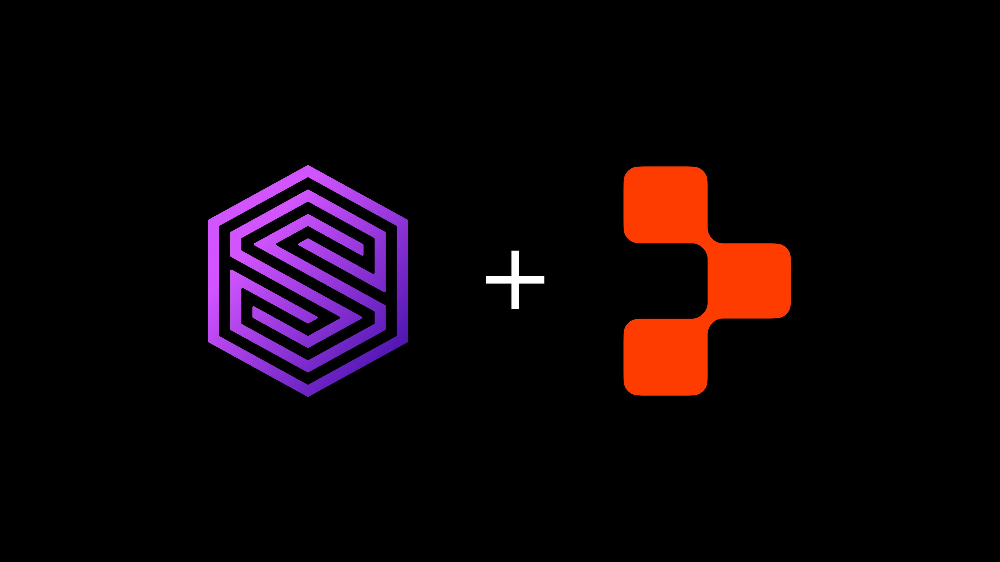

# Bring SurrealDB to your Replit Agent



Replit Agent turns a prompt into a working app. SurrealDB is the one database behind that app, covering documents, graph, vectors, and SQL in a single engine. The piece that connects them is the Model Context Protocol (MCP).

Every SurrealDB instance running 3.1 or later can expose a first-party MCP server: a typed tool surface that AI agents call to inspect your schema and run queries safely. Replit Agent supports any MCP server as a connector, and adds them with a single click. Put the two together and Replit can build directly from the data you already have in SurrealDB.

This is vibe coding for teams that already own their data. Instead of letting an agentic coding tool improvise a throwaway backend, you point Replit at SurrealDB and build on a database you already trust, with the agent reading your real schema as it goes.

This guide is a hands-on quickstart. By the end you will have SurrealDB 3.1 running with its MCP server enabled, connected to a Replit project, and you will have prompted Replit Agent to generate a real interface on top of your data.

## What you'll need

You need a few things before you start, and none of them take more than a few minutes to set up.

You need SurrealDB 3.1.0 or later. You also need a way to reach your instance from the internet, because Replit's connectors talk to your MCP server over HTTP and the server needs a public URL. A SurrealDB Cloud instance gives you one out of the box; for a local instance you can use a tunnel, which we cover below. You need a Replit account. Finally, you need some data. Even a handful of records is enough to see the workflow end to end, and we create a small schema below so you have something to build against.

It is worth noting how this differs from Replit's built-in database. Replit Agent provisions a managed Postgres instance for the app it builds, which it owns. With SurrealDB over MCP, you own the database. Replit connects to a SurrealDB instance you already run, reads its schema as context, and can query or mutate it through a typed, permissioned tool surface. This is the right pattern when SurrealDB is your system of record and you want to build interfaces on top of it rather than spin up a new backend.

## How SurrealDB, MCP, and Replit fit together

There are three moving parts to understand before the steps.

SurrealDB 3.1 exposes a typed tool surface for AI agents. Rather than handing an agent a raw SQL console, the MCP server presents twelve defined tools: `query`, `select`, `create`, `insert`, `upsert`, `update`, `delete`, `relate`, `info`, `list`, `use`, and `run`. Each tool carries annotations (`read_only_hint`, `destructive_hint`, `idempotent_hint`) so an MCP client like Replit knows which operations are safe and which mutate data. The server also publishes self-describing schema resources at URIs like `surrealdb://schema/ns/{ns}/db/{db}/table/{table}`, so the agent discovers your tables and fields instead of guessing.

You can run that MCP server two ways. Locally, surreal mcp runs as a stdio subcommand, which suits IDE integrations on your own machine. For a remote client like Replit, the server is exposed over HTTP at `/mcp`, sitting behind SurrealDB's existing authentication middleware. We use the HTTP path here, because Replit needs to reach your server over the network.

Replit Agent treats MCP servers as connectors. Replit ships a curated list of MCP servers that install in one click, and lets you add any other server, including your SurrealDB instance, from the Integrations pane. All MCP traffic passes through Replit's security scanner, which inspects tool definitions and planned executions and blocks anything it judges unsafe before it runs. Once your SurrealDB endpoint is connected, the agent pulls your live schema and data into context while it builds.

## Step 1: Install or upgrade to SurrealDB 3.1

If you are already on a 3.1.x release you can skip ahead. Otherwise, pick whichever install path matches your setup. Each pins to a specific version; drop the `--version` flag to always get the newest stable.

macOS (Homebrew), then upgrade in place:

```cli
surreal upgrade --version 3.1.5
```

Linux and macOS install script, which auto-detects your architecture:

```cli
curl -sSf https://install.surrealdb.com | sh -s -- --version 3.1.5
```

Windows (PowerShell), then upgrade in place:

```cli
surreal upgrade --version 3.1.5
```

Docker, to pull and run the exact image:

```cli
docker run --rm --pull always -p 8000:8000 surrealdb/surrealdb:v3.1.5 start
```

The `surreal upgrade` command can swap any existing install, whether Homebrew, install script, or manual binary, to the version you specify. Patch releases on the 3.1 line are drop-in upgrades.

If you are on SurrealDB Cloud, you can upgrade your instance in place from the Surrealist app, and you already have a public HTTPS endpoint, which makes the networking in Step 4 considerably simpler.

Verify your version:

```cli
surreal version
```

## Step 2: Start your instance and create some data

For a local run, start a server with authentication enabled. The MCP HTTP endpoint sits behind the same auth middleware as the rest of SurrealDB, so credentials matter here.

```cli
surreal start \
  --user root --pass pass \
  rocksdb://mydata.db
```

This starts SurrealDB on `http://localhost:8000` with a persistent RocksDB store and a root user. In production you would scope down to a namespace and database user rather than root, which we cover under permissions later.

Now give Replit something to build against. use the CLI's `surreal sql` command to open a session, or use Surrealist, the visual query tool, and define a small schema. We model a simple product catalog with reviews, which is enough to show off SurrealDB's record links.

```surrealql
-- Pick a namespace and database to work in
USE NS shop DB catalog;

-- A products table
DEFINE TABLE product SCHEMAFULL;
DEFINE FIELD name        ON product TYPE string;
DEFINE FIELD price       ON product TYPE number;
DEFINE FIELD in_stock    ON product TYPE bool DEFAULT true;
DEFINE FIELD created_at  ON product TYPE datetime DEFAULT time::now();

-- A reviews table that links back to a product
DEFINE TABLE review SCHEMAFULL;
DEFINE FIELD product ON review TYPE record<product> REFERENCE;
DEFINE FIELD rating  ON review TYPE int ASSERT $value IN 0..=5;
DEFINE FIELD body    ON review TYPE string;

-- Seed a few records
CREATE product SET name = "Aeropress", price = 39.95;
CREATE product SET name = "Gooseneck Kettle", price = 64.00;
CREATE product SET name = "Burr Grinder", price = 129.00, in_stock = false;
```

A `SCHEMAFULL` table means SurrealDB enforces the field definitions, which is what you want when an AI agent is going to read and write the table. The schema becomes the contract the agent builds against. Because SurrealDB publishes that schema as an MCP resource, Replit reads these field types directly rather than inferring them from sample rows.

## Step 3: Enable the MCP server over HTTP

In 3.1, the MCP HTTP surface is served at `/mcp` on the same port as the rest of the HTTP API, behind authentication. A handful of environment variables let you tune its limits. The defaults are sensible, but it is worth knowing they exist:

- SURREAL_HTTP_MAX_MCP_BODY_SIZE: maximum request body size (default 4 MiB)
- SURREAL_MCP_QUERY_TIMEOUT_SECS: per-query timeout (default 60 s)
- SURREAL_MCP_MAX_RESULT_BYTES: maximum result payload (default 256 KiB)
- SURREAL_MCP_RUN_MAX_ARGS: maximum arguments to the run tool (default 64)
- SURREAL_MCP_PARAMS_MAX_KEYS: maximum bound parameters per call (default 256)

For example, to allow larger result payloads while keeping a tight query timeout:

```cli
SURREAL_MCP_MAX_RESULT_BYTES=1048576 \
SURREAL_MCP_QUERY_TIMEOUT_SECS=30 \
surreal start --user root --pass pass rocksdb://mydata.db
```

For PowerShell users on Windows

```surrealql
$env:SURREAL_MCP_MAX_RESULT_BYTES = "1048576"
$env:SURREAL_MCP_QUERY_TIMEOUT_SECS = "30"
surreal start --user root --pass pass rocksdb://mydata.db
```

If instead you want to wire SurrealDB into a local IDE rather than Replit, run the stdio variant, `surreal mcp`, and point your editor's MCP client at that subcommand. For Replit, stick with the HTTP endpoint.

A good sanity check before involving Replit is to confirm the `/mcp` route is reachable and that requests without valid credentials are rejected, which tells you the auth middleware is doing its job.

## Step 4: Make your instance reachable

Replit runs in the cloud, so it needs a public URL for your MCP endpoint. You have two clean options.

The first option is SurrealDB Cloud. If your data lives in a SurrealDB Cloud instance, you already have a public HTTPS endpoint with managed TLS and authentication. Your MCP URL is simply that instance's address with the `/mcp` path appended. This is the lowest-friction path and the one we recommend for anything beyond local experimentation.

The second option is a tunnel to a local instance. For local development, expose `http://localhost:8000` through a tunneling service that gives you a temporary public HTTPS URL, such as ngrok or Cloudflare Tunnel. Your MCP URL is then `https://<your-tunnel-host>/mcp`. This works well for trying things out, but treat the URL as ephemeral and never point it at production data.

Either way, you end up with a single value to hand to Replit: an HTTPS URL ending in `/mcp`, plus the credentials needed to authenticate against it.

> Security note: The MCP endpoint inherits SurrealDB's authentication and permissions. Before you expose anything, create a dedicated database user scoped to just the namespace and database you want Replit to touch, rather than handing over root. SurrealDB enforces record-level and field-level permissions on every query the agent runs, so a properly scoped user cannot read or write beyond what you have granted, even if the agent asks it to.

## Connect SurrealDB to Replit

Now switch over to Replit. Because MCP is a standard, you add SurrealDB the same way you would any custom server.

1. Open your app in the Project Editor and open the Integrations pane (or go to replit.com/integrations).
1. Choose Add new integration, then add a custom MCP server.
1. Server URL: paste your MCP endpoint, for example https://your-instance.surrealdb.cloud/mcp or your tunnel URL ending in /mcp.
1. Authentication: Replit supports OAuth dynamic client registration where a server offers it, or custom headers for static tokens. For a SurrealDB instance, use a custom header with key `Authorization` and value `Bearer <token>` for your scoped database user. Reserve no-auth endpoints for a throwaway local demo, never for real data.
1. Authorize the connection. Replit's security scanner inspects the server's tools, and the connection persists across your apps once approved.

## Build an app on your SurrealDB data with Replit

With the connector live, Replit Agent calls SurrealDB's tools to discover your schema and read your records, then generates UI that is wired to that data.

Start by pulling your data into context with a prompt like this:

> Using my SurrealDB connector, list the tables in the shop/catalog database and show me the fields on the product table.

This prompts Replit to call the `list` and `info` tools and read the schema resource, then report back what it found. Behind the scenes, `use` selects the `shop` namespace and `catalog` database, and the schema resource at `surrealdb://schema/ns/shop/db/catalog/table/product` tells Replit that `product` has `name`, `price`, `in_stock`, and `created_at` with their exact types.

Once it understands your schema, ask it to build:

> Build a product catalog page that shows every product from SurrealDB as a card with its name, price, and stock status. Add a filter to show only in-stock items.

Replit reads your live products via the `select` tool, scaffolds a front end, and binds the components to the real fields. Because the agent knows `in_stock` is a boolean from the schema, the filter it builds is correct on the first pass rather than a guess.

You can go further and let it traverse relationships, which uses SurrealDB's graph capabilities:

> Add a detail view for each product that lists its reviews, the rating and body, pulled from the review table that links to the product.

Here SurrealDB's record links do the heavy lifting. A SurrealQL query like `SELECT *, <~review.{ rating, body } AS reviews FROM product` fetches each product together with its reviews in one round trip. The `<~` operator walks incoming record references the same way graph queries do, and Replit issues exactly that through the `query` tool.

When you ask Replit to write data, such as adding a form to submit a new review, the agent reaches for the `create` or `insert`tool. Because those tools carry the non-read-only annotations, Replit knows they mutate state and can surface a confirmation before anything is written. Your SurrealDB permissions remain the backstop: if the connected user lacks `CREATE` permission on `review`, the write fails at the database regardless of what the agent attempts.

## SurrealDB MCP tools reference

Knowing what each tool does tells you exactly what you can ask Replit to do with your data.

- `query`: run arbitrary SurrealQL. The most powerful tool, and the one behind any complex read or graph traversal.
- `select`: read records from a table, optionally filtered.
- `create` and `insert`: add new records, with insert geared toward bulk.
- `upsert`: create or update depending on whether the record exists.
- `update`: modify existing records.
- `delete`: remove records, which is a destructive operation.
- `relate`: create graph edges between records, SurrealDB's relational strength.
- `info`: describe the structure of a namespace, database, or table.
- `list`: enumerate available namespaces, databases, or tables.
- `use`: select the namespace and database to operate within.
- `run`: invoke a defined function on the server.

The read-only tools (`select`, `info`, `list`) are safe to let an agent call freely. The mutating tools (`create`, `insert`, `upsert`, `update`, `delete`, `relate`) are the ones the hint annotations flag, and the ones your database permissions should govern most tightly.

## Production considerations for SurrealDB with Replit

A few things are worth getting right before you let real users near a SurrealDB-backed Replit app.

Scope the connected user tightly. Create a database-level user with only the permissions the app needs. SurrealDB's permission model is enforced on every query, including record-level and field-level `SELECT`, `CREATE`, `UPDATE`, and `DELETE` permissions, so the agent is constrained by the database, not just by good behavior.

Use the limits. The MCP environment variables exist to keep a chatty agent from overwhelming your instance. Set a sensible `SURREAL_MCP_QUERY_TIMEOUT_SECS` and `SURREAL_MCP_MAX_RESULT_BYTES` for your workload.

Prefer Cloud or a stable endpoint over a dev tunnel. Tunnels work for trying this out, but they are ephemeral. For anything persistent, a SurrealDB Cloud instance, or your own properly secured deployment, is the right home.

Keep your token out of shared links. A Replit install link with an `Authorization` header baked in carries a real credential. Generate it for your own use and rotate the token if it leaks.

## Where this leaves you

You now have a SurrealDB instance whose schema and data are first-class context for Replit Agent, exposed through a typed, permissioned, observable MCP surface. The same connection that lets Replit build a catalog page would let it scaffold an admin dashboard, a customer-facing storefront, or an internal tool, all reading from and writing to the one database you control.

That is the shape of the SurrealDB and Replit workflow: SurrealDB is the system of record and the source of truth for structure, and Replit is the interface layer that builds on top of it. MCP is the standard that makes the two speak the same language, with no bespoke integration to maintain on either side. It is what turns vibe coding and agentic coding from a demo trick into a workflow you can run against your own data.

From here, a few good next steps are to define a SurrealDB function and invoke it from Replit via the `run` tool, so business logic lives in the database where the agent can reuse it; to model a richer graph with `RELATE` and ask Replit to build views that traverse it; and to move from a dev tunnel to a Cloud instance and tighten your user permissions for a real deployment.
