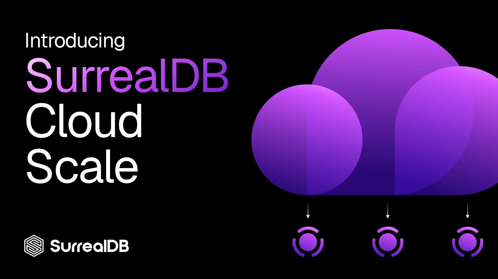

# Introducing Scale: SurrealDB Cloud, built for high availability and scale

Today we're launching **Scale**, a new tier of SurrealDB Cloud built for the workloads you can't afford to have go down.

Our first tier, Start, was designed for building and shipping fast. Scale is designed for what happens next: production traffic, uptime commitments, and the kind of resilience your users never notice because there are always available nodes. It's the tier for teams running SurrealDB as the scalable context layer behind real applications and AI agents in production.

## What you get with Scale

Scale is about one thing: keeping your database available and consistent under real-world conditions.

**Highly-available, fault-tolerant clusters.** Scale runs your database as a multi-node cluster designed to survive node and infrastructure failures without dropping writes or losing consistency. A single point of failure is no longer a single point of downtime.

**Multiple availability-zone deployment.** Your cluster is distributed across multiple availability zones, so even the loss of an entire zone doesn't take your database with it. Traffic keeps flowing while the cluster recovers in the background.

**Horizontal scale.** As demand grows, Scale grows with it. Add capacity by scaling out across nodes rather than being capped by the size of a single machine. Start with three nodes, and keep adding to scale your application or agent's needs.

See more information about SurrealDB Cloud Scale architecture [here.](https://surrealdb.com/docs/manage/cloud/architecture#scale)

## Built on SurrealDS

Scale is powered by [SurrealDS](https://surrealdb.com/platform/surrealds), SurrealDB's distributed storage engine and the foundation that makes all of this possible.

SurrealDS is a new generation distributed storage architecture, rethought from first principles. Instead of coupling storage to compute on a single box or to a proprietary cloud tier, SurrealDS embeds consensus directly in SurrealDB nodes and separates the two layers cleanly. Here's what that architecture gives you.

**Architecture overview**

- **Compute and storage separation**. Scale compute for QPS and storage for capacity independently, so you provision for the dimension that's actually under pressure.
- **No single leader**. Each availability-zone node writes locally, writes scale horizontally, and transactions commit once a quorum acknowledges them.
- **Multi-write nodes**. Every write node in the cluster can accept and coordinate transactions - there's no bottleneck routing all writes through one leader.
- **Reduced operational overhead**. Consensus is embedded directly in SurrealDB nodes, eliminating external coordination services.
- **Fewer network dependencies**. A single broadcast replaces multi-hop coordination, reducing latency.
- **Lower latency than leader-based replication**. With no single leader and each AZ node writing locally, transactions avoid the extra round trips of traditional leader-based systems.

**Future roadmap**

Several SurrealDS capabilities are on the near-term roadmap and will land in the Scale tier as they ship:

- **Object-storage backed**. Persist transactional data directly to commodity object storage - storage costs drop and capacity scales far beyond any single disk.
- **Cross-region replication**. Data flows through object storage rather than between nodes, significantly reducing data-transfer costs while keeping regions in sync.
- **Instant recovery**. A crashed node restores from object storage, with recovery time almost instant regardless of dataset size.
- **Instant branching**. Clone a petabyte-scale database in seconds for development, testing, or experimentation.

## Get started

If you're running SurrealDB in production, or getting ready to, Scale gives you the availability and fault-tolerance your workloads need, on the storage architecture no one else has.

Explore the tier in [SurrealDB Cloud](https://surrealdb.com/cloud), and dig into the engine underneath at [SurrealDS](https://surrealdb.com/platform/surrealds).
